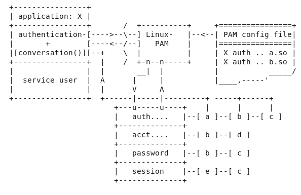

## UNDERSTANDING PAM FOR LINUX

1. Most of this file is not my original work and is created by copying important stuff from the official documentation of `pam-1.1.1` installed by default with the last RHEL 6.10 release.

- As this release of RHEL is the last minor release of RHEL 6 major release candidate, I updated the whole  RHEL 6.10 system and then extracted the contents so I beleive that this file will remain current for systems based on RHEL 6.

- Linux-PAM (**Pluggable Authentication Modules for Linux**) is a suite of shared libraries that enable the local system administrator to choose how applications authenticate users.

- In other words, without rewriting and recompiling a PAM aware application, it is possible to switch between the authentication mechanisms it uses.

- It is the purpose of the Linux-PAM project to separate the development of privilege granting software from the development of secure and appropriate authentication schemes.

- This is accomplished by providing a library of
functions that an application may use to request that a user be authenticated.

- This PAM library is configured locally with a system file, `/etc/pam.conf` or a series of configuration files located in `/etc/pam.d/` to authenticate a user
request via the locally available authentication modules. 
    
    The modules themselves will usually be located in the directory `/lib/security` or `/lib64/security` and take the form of dynamically loadable object files.

- The flexibility of Linux-PAM is that you have the freedom to stipulate which authentication scheme is to be used. You have the freedom to set the scheme for any/all PAM aware applications on your Linux system.

- Linux-PAM deals with four separate types of management  tasks, these are:

    1. Authentication management.
    - Account management.
    - Session management.
    - Password management.

- Here is a figure that describes the overall organization of Linux-PAM: 
  
    

    By way of explanation, the left of the figure represents the application named X. Such an application interfaces with the Linux-PAM library and knows none of the specifics of its configured authentication method. The Linux-PAM library (in the center) consults the contents of the PAM configuration file and loads the modules that are appropriate for application X. These modules fall into one of four management groups (lower-center) and are stacked in the order they appear in the configuration file. These modules, when called by Linux-PAM, perform the various authentication tasks for the application. 

    Textual information, required from/or offered to the user, can be exchanged through the use of the application-supplied conversation function.

- If a program is going to use PAM, then it has to have PAM functions explicitly coded into the program. If you have access to the source code you can add the appropriate PAM functions. **If you do not have access to the source code, and the binary does not have the PAM functions included, then it is not possible to use PAM**.

- When a PAM aware privilege granting application is started, it activates its attachment to the **PAM-API**. This activation performs a number of tasks, the most
important being the reading of the configuration file(s): `/etc/pam.conf`.
Alternatively, this may be the contents of the `/etc/pam.d/` directory. The
presence of this directory will cause Linux-PAM to ignore `/etc/pam.conf`.

    These files list the PAMs that will do the authentication tasks required by this service, and the appropriate behavior of the PAM-API in the event that individual PAMs fail.

- **Configuration file syntax**

   